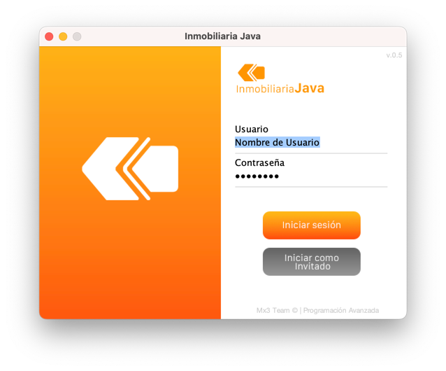
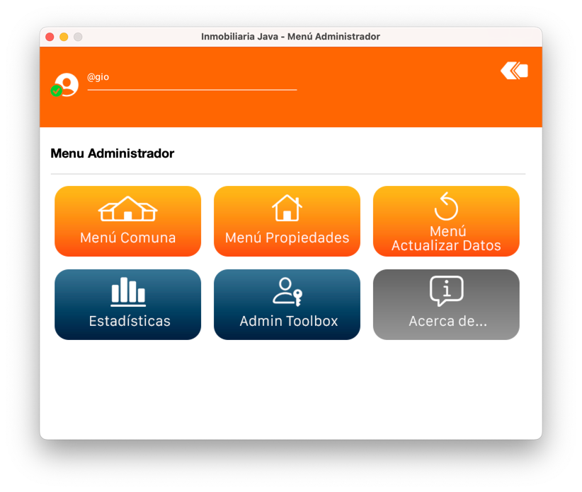
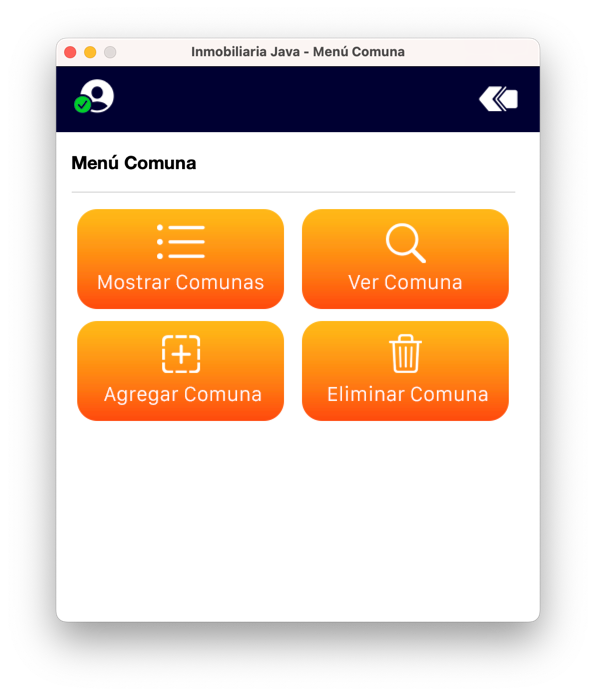
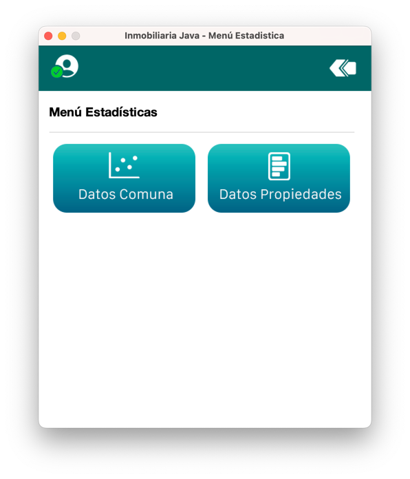

# 🏡 Proyecto de Semestre 1: Gestión de Inmobiliaria

Bienvenido al proyecto de gestión de inmobiliaria. Este proyecto se centra en el manejo de ventas de departamentos, gestionando la demanda y los precios (mayor demanda implica mayores precios).

## 📖 Descripción
Este proyecto permite gestionar la venta de departamentos, incluyendo la administración de la demanda y los precios. A medida que la demanda aumenta, los precios también lo hacen, proporcionando una simulación realista del mercado inmobiliario.

## ✨ Características
- Gestión de ventas de departamentos.
- Administración de demanda y precios.
- Interfaz amigable y fácil de usar.

## 📷 Imágenes




<div style="text-align: center;">
    <p float="left">
        
        
    </p>
</div>

## 🚀 Instalación

### Requisitos
- Java < 14
- Maven < 3.6.3
- Homebrew (Opcional)

### Instalación de Maven 📦
(Para MacOS o Linux)

```bash
brew install maven
```

Debes tener instalado Homebrew para poder ejecutar el comando anterior. Si no tienes Homebrew, puedes instalar Maven de la siguiente manera:

**O** 
```bash
sudo apt-get install maven
```

### Compilación y ejecución 🛠️

Para compilar y ejecutar el proyecto, debes ejecutar los siguientes comandos:

```bash
mvn clean package
```

```bash
mvn exec:java -Dexec.mainClass="App"
```

Nota: Debes estar en la raíz del proyecto para poder ejecutar el comando anterior.

# 👥 Integrantes
    Bastian Mejias
    Patricio Hernandez
    Giovanni Ahumada

# 📝 Licencia
Este proyecto está bajo la licencia MIT.
